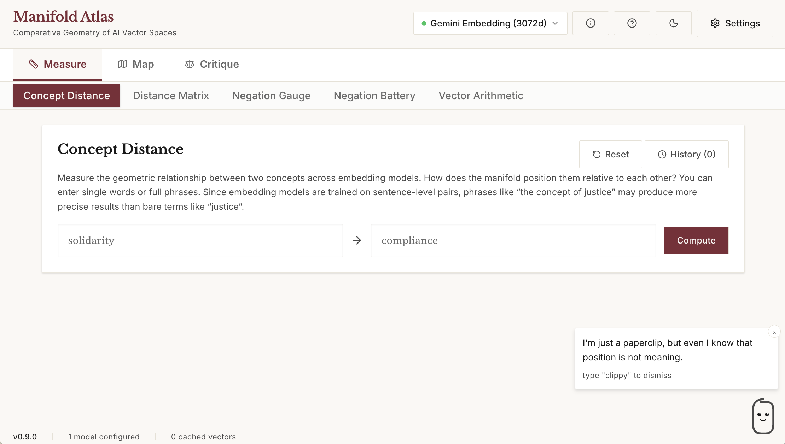
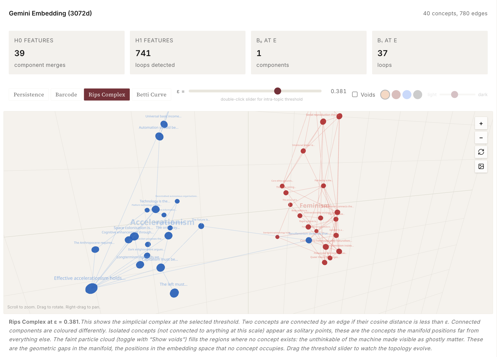

> Part of the [Vector Lab](https://github.com/vector-lab-tools) — vector methods for vector theory.
> [Overview and map](https://vector-lab-tools.github.io) · [Org profile](https://github.com/vector-lab-tools)
>
> **Tier:** comparative model tool. **Object:** output embeddings across models.
>
> **Sibling instruments:** [Vectorscope](https://github.com/vector-lab-tools/vectorscope) · [Manifoldscope](https://github.com/vector-lab-tools/manifoldscope) · [Theoryscope](https://github.com/vector-lab-tools/theoryscope) · [LLMbench](https://github.com/vector-lab-tools/LLMbench)

# Manifold Atlas

**Comparative geometry of AI vector spaces.**

**Author:** David M. Berry
**Institution:** University of Sussex
**Version:** 1.2.0
**Date:** 23 April 2026
**Licence:** MIT

Manifold Atlas is a vector-native research tool for studying how large language models organise meaning geometrically. It uses embedding APIs from multiple AI providers to collect coordinates from the manifold, then computes distances, clusters, and projections that reveal the geometry's structure.



The tool operationalises [Vector Theory](https://stunlaw.blogspot.com/2026/02/vector-theory.html) theorised by David M. Berry. This includes the embedding API as telescope, the manifold as the object of study, and cosine similarity as the primary instrument. Without the framework, the numbers are curiosities. With it, they are evidence for geometric ideology, the negation deficit, and the proprietary encoding of human language.

## Scholarly Context

Manifold Atlas emerges from the convergence of three research programmes.

**Vector theory.** Berry (2026) *Vector Theory* argues that the vectorial turn introduces a new computational regime in which definition is replaced by position, truth by orientation, argument by interpolation, and contradiction by cosine proximity. The embedding layer performs a real abstraction at the level of meaning itself: heterogeneous language is converted into homogeneous geometric coordinates within a proprietary manifold. Manifold Atlas is the research instrument for this framework.

**The negation deficit and geometric ideology.** A sustained claim across the Stunlaw blog series is that the manifold's geometry encodes ideology topologically (in density, sparsity, and trajectory) rather than discursively. Negation is not a logical operator in the manifold; it is a small rotation in a few dimensions. Agonism collapses into proximity. These are empirical claims and they need an empirical instrument to test them. The Negation Gauge, Negation Battery, Hegemony Compass, Silence Detector, and Agonism Test each operationalise a specific claim of the theory.

**Comparative, multi-model method.** No single embedding API offers a window onto "the manifold." Each API returns a particular geometry shaped by training data, architecture, and commercial decisions. Multi-model comparison is not a nice-to-have; it is the methodological precondition for distinguishing structural features of the vectorial regime from features contingent on a particular model. Manifold Atlas is built to compare geometries rather than to pick one.

## Embedding Models vs Chat Models: A Primer

Manifold Atlas uses two kinds of AI model, and it helps to understand the difference.

A **chat model** (GPT-4o, Claude, Llama) takes text in and produces **text** out. You give it a prompt, it generates a response. The output is language.

An **embedding model** (text-embedding-3-small, nomic-embed-text) takes text in and produces a **vector** out: a list of numbers (e.g. 768 or 3,072 floating-point values). No language comes back, just coordinates in a high-dimensional space. Those coordinates are the model's geometric encoding of what the text "means", where meaning is reduced to position. The embedding model is the telescope: it converts text into a location in the manifold.

Both are built from transformer architectures trained on large corpora. A chat model has an embedding layer internally (it converts tokens to vectors as its first step), but then processes those vectors through many more layers and converts back to language. An embedding model stops earlier: it produces the vector and hands it to you. This is why embedding API calls are cheap (fractions of a penny) while chat API calls are expensive.

In Manifold Atlas, the **embedding models** are the core instrument. Every operation uses them to produce vectors for analysis. The **chat model** is only used for one feature: Manifold Scan, where it generates ~300 related terms from a seed concept. If you are using Ollama locally, you need an embedding model (e.g. `nomic-embed-text`) for all operations, and a chat model (e.g. `llama3.2`) only if you want to use Manifold Scan.

## Operations at a Glance

Manifold Atlas is organised as a tabbed workspace with fifteen operations. Each operation tests a specific claim of vector theory.

| Operation | Core question | Theoretical anchor |
|---|---|---|
| Concept Distance | How close are A and B in the manifold? | Cosine similarity as primary instrument |
| Neighbourhood Map | What is the local structure around a concept? | Geometric ideology (density and sparsity) |
| Negation Gauge | How much space does negation actually get? | The negation deficit |
| Negation Battery | Does the deficit hold across a set of statements? | The negation deficit at scale |
| Semantic Sectioning | What lies between two concepts? | Manifold sectioning |
| Vector Walk | What does a trajectory through the manifold look like? | Reading as geometric trajectory |
| Vector Drift | How does context displace a concept? | Geometric stress testing |
| Hegemony Compass | Which ideological framing has the geometry naturalised? | Hegemonic defaults |
| Real Abstraction Test | How complete is the real abstraction? | Real abstraction (Sohn-Rethel) |
| Distance Matrix | Where do multiple models disagree most? | Proprietary medium (multi-model) |
| Agonism Test | Does philosophical opposition survive geometrisation? | Agonism collapse |
| Vector Logic | Can analogical inference be performed as arithmetic? | A − B + C = ? as critical test |
| Grammar of Vectors | Does the rhetoric of "not X but Y" antithesis match the cosine geometry of X and Y? | Vector logic's native grammar / the pseudo-dialectic |
| Silence Detector | Which domains does the geometry flatten? | The taxonomy of silence |
| Text Vectorisation | What is the shape of reading through the manifold? | Reading as geometric trajectory |
| Persistent Homology | What can the geometry not represent? | The unthinkable of the machine |

## Features

### Concept Distance
Measure the geometric relationship between any two concepts. Enter two terms and see their cosine similarity across all configured embedding models, with detailed metrics (angular separation, euclidean distance, vector norms, top contributing dimensions) and interpretive text explaining what the similarity level means.

### Neighbourhood Map
Map the local structure of the manifold around a concept. Enter terms manually, load presets (Philosophy, Carpentry, Critical Theory, Democracy, etc.), or use **Manifold Scan** to auto-generate ~300 related terms and fire them all into the embedding space. Interactive 3D scatter plot with auto-rotation, cluster detection, connection mesh, and cross-domain analysis (border concepts, bridges, inter-manifold distance).

### Negation Gauge
Negation works differently in the manifold than in logic. Where logic treats "A" and "not A" as categorical opposites, the geometry stores them close together, differing in only a few dimensions out of hundreds. The tool embeds both the original statement and its auto-generated negation, measures their cosine similarity, and shows how much space the manifold actually gives to negation. Includes a similarity meter, detailed metrics, and theoretical context on the negation deficit.

### Negation Battery
Run a battery of negation tests automatically against pre-built sets or custom statements. Ships with seven built-in batteries covering political, ethical, factual, epistemological, economic, aesthetic, and technology claims (10 statements each, 70 total). Users can save their own custom statements as named batteries that appear in the dropdown alongside the built-ins and are addressable by name from protocol steps. Produces a report card with collapse rate, average similarity, per-statement results table, and CSV export.

### Semantic Sectioning
Interpolate between two anchor concepts in the embedding space to discover what lies between them. The tool walks from concept A to concept B in 20 steps, finding the nearest real concept at each point. The resulting sequence (e.g. solidarity -> cooperation -> agreement -> conformity -> compliance) reveals where one domain shades into another in the manifold's geometry.

### Vector Walk
Watch a particle walk through the manifold from one concept to another. Built with Three.js for smooth 60fps animation. The path is a linear interpolation in the high-dimensional embedding space, projected to 3D via PCA with post-projection repulsion to spread overlapping concepts apart. 80 reference concepts across 7 domains (political, economic, knowledge, technology, nature, everyday life, science) are distributed through the space as a grey point cloud with labels. As the particle moves, the 20 nearest concepts light up in gold with connecting lines, showing the local neighbourhood at each step. Press Walk to animate, use the slider to scrub manually, or click Ride to attach the camera to the particle and travel through the manifold in first person. Zoom in/out buttons for both orbital and ride views. Eight presets for distant concept pairs (love → algorithm, nature → computation, democracy → surveillance, etc.).

### Vector Drift
Measure how much context displaces a concept's position in the manifold. Embed the same term as a propositional sentence with different contextual framings and watch it move through the geometry. Three visualisations per model: a 3D drift cloud showing all positions simultaneously with connecting lines back to the bare concept; sorted displacement bars showing which contexts produce the largest geometric displacement; and a pairwise pathway heatmap revealing which contextual framings converge (similar routes through the manifold) and which diverge. Includes Sentence Sensitivity mode, which auto-generates 15 phrasings per concept across five categories (definitional, contextual, negational, propositional, metaphorical) and fires them all into the embedding space.

### Hegemony Compass
Place a contested concept ("freedom", "democracy", "intelligence") between two competing ideological clusters and measure which side the manifold pulls it toward. Pre-loaded tests for Freedom (market liberalism vs emancipatory politics), Democracy (liberal proceduralism vs radical democracy), Intelligence (techno-rationalism vs embodied cognition), Security, and Progress. The result reveals which ideological framing the geometry has naturalised as the default meaning.

### Real Abstraction Test
Measure how far the manifold has performed the real abstraction (after Sohn-Rethel). Each pair contrasts a concrete use-value description ("a warm coat that keeps the rain off") with its abstract exchange-value equivalent ("a commodity worth twenty yards of linen"). If the distance is small, the abstraction is already complete in the geometry. If large, the use-value has partially resisted encoding. 12 pre-loaded pairs across domains from clothing to care work.

### Distance Matrix
Enter a list of concepts and get a full pairwise cosine similarity heatmap across all enabled models. Highlights the most and least similar pairs, and when multiple models are enabled, identifies pairs where models disagree most (politically contested geometry). CSV export.

### Agonism Test
Does the manifold preserve genuine philosophical opposition, or collapse it into proximity? Eight pre-loaded debates (Marx vs Burke, Hegel vs Kierkegaard, Arendt vs Schmitt, Foucault vs Aristotle, and more). The agonism score measures how much intellectual conflict survives geometrisation. This is the negation deficit extended from logic to philosophical antagonism.

### Vector Logic
The narrowest test of vector logic: the claim that analogical inference can be performed as arithmetic on embedding vectors. The classic word2vec operation (A - B + C = ?) applied to modern embedding models with critical intent. "King minus man plus woman equals queen" was the original demonstration. Pre-loaded analogies include "capitalism minus exploitation plus cooperation equals ?" and "technology minus efficiency plus care equals ?". Tests whether the manifold's geometry preserves conceptual relationships that critical theory depends on.

### Silence Detector
Compare how much geometric space the manifold allocates to different domains. When terms within a domain are spread apart (low pairwise similarity), the manifold distinguishes between them, allocating more representational space. When terms are packed together (high pairwise similarity), the manifold compresses them, treating distinct concepts as near-interchangeable. Pre-loaded comparisons: financial derivatives vs subsistence farming, Silicon Valley vs indigenous ecological knowledge, corporate management vs care work. The differential reveals which domains the geometry takes seriously and which it flattens.

### Text Vectorisation
Paste a passage of text and watch a particle trace its reading path through the manifold. Every word is embedded and projected to 3D via PCA. The particle visits each word in reading order, with the 6 nearest words in the embedding space highlighted by connecting lines at each step. The trail colour is selectable (red, amber, blue, green, purple) and fades from soft to bright, showing the geometric trajectory of reading. When a word repeats, the particle returns to the same position, revealing how the text loops back through semantic space. The source text is displayed above the 3D scene with the current word highlighted. Step forward/back buttons for manual word-by-word navigation and an adjustable speed slider for the read animation. Smooth transitions between states using per-frame lerping. Batched embedding supports texts up to 200 unique words across multiple API calls. Seven preset passages: Hinton (1977) on distributed representations, Deleuze on societies of control, Impett and Offert on vector media, Kittler on the absence of software, Rosenblatt on the perceptron as brain model, Weizenbaum on the programmer as lawgiver, and Berry on the vector medium. Deep dive panel with summary metrics, word frequency table with nearest neighbours, BPE subword token preview (approximate, using cl100k_base), reading path, and CSV export. PNG screenshot export.

### Grammar of Vectors
Maps discursive quirks of LLM text generation — currently the "Not X but Y" pattern and its intensified "Not just X but Y" variant. Language models constantly produce constructions like "not a problem, but an opportunity" or "not merely efficient, but meaningful". The rhetoric performs antithesis while the underlying geometric move is a slight rotation to a near-neighbour. The operation embeds the X and Y fragments the construction claims are opposed and measures their cosine similarity — a gap between rhetorical opposition and geometric reality. Ships with four register batteries per grammar (Marketing, AI pedagogical, Political op-ed, Technology discourse, ~12 phrases each) plus a custom mode that parses either pasted prose or `X | Y` pipe pairs. Results show the per-construction × per-model matrix with above-threshold values flagged; CSV export. Companion protocol "Grammar of Vectors Sweep" runs both grammars across all four registers in one click. The operation also accepts deep-link URL parameters (`?x=…&ys=…&source=llmbench-grammar-probe`) so future LLMbench Grammar Probe sessions can hand off candidate continuations for cosine analysis.

### Persistent Homology
Persistent homology (Topological Data Analysis) applied to embedding spaces. Measures the shape of the manifold across all scales simultaneously by gradually increasing a distance threshold and tracking when topological features (clusters, loops) appear and disappear. Pure TypeScript Vietoris-Rips implementation. Four visualisation modes: persistence diagram (birth vs death scatter), barcode diagram (horizontal bars sorted by persistence), Rips complex (Three.js 3D scene with component colouring, hover tooltips, auto-rotate, and PNG export), and Betti curve (connected components and loops vs threshold). The Rips complex view includes an optional void cloud: a nebulous particle fog (custom shader with depth-based size attenuation) that fills empty regions inside the manifold, making the unthinkable of the machine visible as ghostly matter. Void colour (amber, burgundy, blue, smoke) and intensity are adjustable. Twenty toggle-chip presets spanning political claims, knowledge domains, critical theory, AI and computation, labour and capital, ecology, media and culture, body and phenomenology, tech company claims, accelerationism, effective altruism, finance, feminism, ecology, neoliberalism, philosophy of mind, existentialism, media archaeology, literary critique, and semiotics. Select multiple presets to overlay them with topic colouring and centroid labels. Double-click the threshold slider to snap to the intra-topic connectivity threshold.



## Library

The Library (fourth tab group) runs curated sequences of operations in one click. Each protocol is a named set of steps with pre-filled inputs that produces a structured, exportable report (Markdown, JSON, CSV, PDF). The Library ships with seven built-in protocols spanning Demo, Critique, and Research categories — including the Hegemonic Defaults Sweep (three Hegemony Compass probes plus a Distance Matrix over political vocabulary), 'Fake' News Test (four pre-built batteries plus the full Agonism Test), Political Contestation Test, Vector Logic Test, Negation Audit, Vector Logic Demo, and Concept Distance Demo.

Every step of every protocol is editable before running. The per-step editor lets you substitute your own claims into a Negation Battery, swap anchors in a Semantic Sectioning walk, change the A − B + C terms, reframe the Hegemony Compass, or rewrite the opposed positions in an Agonism Test. Edits apply to the next run and are reflected in the exported bundle, so you can re-run an existing protocol against your own inputs without leaving the app.

Eight of the fifteen operations are wired to the Runner (Concept Distance, Distance Matrix, Vector Logic, Negation Gauge, Negation Battery, Semantic Sectioning, Agonism Test, Hegemony Compass). The remaining visualisation-heavy operations (Neighbourhood Map, Vector Drift, Vector Walk, Text Vectorisation, Persistent Homology, Real Abstraction Test, Silence Detector) remain available in their own tabs.

You can also add your own tests. The Add Test modal accepts either pasted markdown or an uploaded .md file. A Start-from dropdown lets you load any built-in test as a template to edit, or start from a minimal three-step example. Added tests are persisted in browser storage, appear in the Library alongside the built-ins with a Custom badge, and can be edited, downloaded as .md, or removed at any time. This makes the tool extensible without any code changes: researchers can distribute their own test markdown alongside a paper, and anyone with the link can load it into Manifold Atlas.

### PDF export for researchers

Each run produces a research-oriented PDF alongside the Markdown / JSON / CSV exports. The PDF carries the protocol title and description, run metadata (timestamp, elapsed, models, query counts), and a full step-by-step deep dive: per-model distance matrices, nearest-concept rankings, negation collapse tables, interpolation paths, battery and agonism cosine matrices, Distance Matrix contested-geometry rankings, and — for Hegemony Compass steps — the compass itself rendered as a static SVG and embedded per model alongside axis statistics and per-concept positions. Suitable for attaching to a paper, a grant application, or a workshop handout.

## Supported Embedding Providers

### Embedding Models vs Chat Models

Manifold Atlas uses two kinds of AI model, and it helps to understand the difference:

A **chat model** (GPT-4o, Claude, Llama) takes text in and produces **text** out. You give it a prompt, it generates a response. The output is language.

An **embedding model** (text-embedding-3-small, nomic-embed-text) takes text in and produces a **vector** out: a list of numbers (e.g. 768 or 3,072 floating-point values). No language comes back, just coordinates in a high-dimensional space. Those coordinates are the model's geometric encoding of what the text "means", where meaning is reduced to position. The embedding model is the telescope: it converts text into a location in the manifold.

Both are built from transformer architectures trained on large corpora. A chat model has an embedding layer internally (it converts tokens to vectors as its first step), but then processes those vectors through many more layers and converts back to language. An embedding model stops earlier: it produces the vector and hands it to you. This is why embedding API calls are cheap (fractions of a penny) while chat API calls are expensive.

In Manifold Atlas, the **embedding models** are the core instrument. Every operation uses them to produce vectors for analysis. The **chat model** is only used for one feature: Manifold Scan, where it generates ~300 related terms from a seed concept. If you are using Ollama locally, you need an embedding model (e.g. `nomic-embed-text`) for all operations, and a chat model (e.g. `llama3.2`) only if you want to use Manifold Scan.

### Supported Providers

You only need to configure the providers you want to use. Enable one or more and ignore the rest.

**Free cloud provider** (free account, no payment required):

| Provider | Models | Sign up |
|----------|--------|---------|
| Hugging Face | MiniLM-L6 (384d), BGE Small (384d), BGE Large (1024d, slow), Mixedbread Large (1024d), Multilingual E5 Large (1024d), Qwen3 Embedding 0.6B (1024d), Granite Embedding 278M Multilingual (768d) | [huggingface.co](https://huggingface.co/) |

To use Hugging Face: sign up at [huggingface.co](https://huggingface.co/) (free), go to Settings > Access Tokens, create a token, and paste it in Manifold Atlas Settings. Rate-limited but fully functional for research use.

**Paid cloud providers** (require an API key from the provider):

| Provider | Models | Sign up |
|----------|--------|---------|
| OpenAI | text-embedding-3-small (1536d), text-embedding-3-large (3072d) | [platform.openai.com](https://platform.openai.com/) |
| Voyage AI (Anthropic) | voyage-3, voyage-3-large, voyage-3.5 (1024d) | [voyageai.com](https://www.voyageai.com/) |
| Google Gemini | gemini-embedding-001 (3072d) | [ai.google.dev](https://ai.google.dev/) |
| Cohere | embed-v3.0 (1024d) | [cohere.com](https://cohere.com/) |
| OpenRouter (OpenAI-compatible) | Various | [openrouter.ai](https://openrouter.ai/) |

**Local provider** (no API key, no account, runs entirely on your machine):

| Provider | Models |
|----------|--------|
| Ollama | nomic-embed-text, mxbai-embed-large, all-minilm, or any embedding model you pull |

To use Ollama, install it from [ollama.com](https://ollama.com/), pull an embedding model (`ollama pull nomic-embed-text`), and enable it in Settings. No API key needed. No data leaves your machine.

## Design Rationale

**Why multiple embedding providers?** A single embedding API returns a single geometry, and there is no way to distinguish, from within that geometry, structural features of the vectorial regime from features contingent on a particular model's training. Multi-provider support is not a nice-to-have; it is the methodological precondition for the tool's central claim. Every operation can be run across providers in parallel, and disagreements between models become the primary research finding rather than a nuisance.

**Why cache in IndexedDB?** Embedding calls are cheap per call but quickly add up when a single operation queries hundreds of concepts across multiple models. The IndexedDB cache is keyed deterministically by model and text, so identical queries return instantly and previous sessions remain inspectable.

**Why no engineering metrics?** Existing vector-geometry tools are designed for engineers tuning a retrieval pipeline. They answer questions like "which embedding gives the best search relevance?" Manifold Atlas answers different questions: where does this model compress what it ought to distinguish? What does the geometry refuse to represent? These are critical-theoretical questions that require geometric evidence, not benchmark scores.

**Why a browser-only tool?** The instrument is for research use, not for production. Running entirely in the browser with only the embedding APIs as external dependencies keeps the deployment surface minimal and the data footprint on the researcher's own machine. API keys never leave the browser. No tracking, no telemetry.

**Why editable `models/*.md` files?** The pace of embedding-model releases outruns any sensible rebuild cadence. Keeping the model registry in markdown rather than in source code lets researchers add a new provider or model as soon as it appears, without touching compiled artefacts.

## Getting Started

### Prerequisites

- [Node.js](https://nodejs.org/) 18 or later
- At least one of: an embedding provider API key (OpenAI, Voyage, Google, or Cohere), or [Ollama](https://ollama.com/) running locally with an embedding model pulled

### Install and Run

```bash
git clone https://github.com/vector-lab-tools/manifold-atlas.git
cd manifold-atlas
npm install
npm run dev
```

Open [http://localhost:3000](http://localhost:3000) in your browser.

### Configure Providers

1. Click **Settings** (top right)
2. Enable one or more embedding providers
3. Enter your API key (or for Ollama, ensure it's running with an embedding model pulled: `ollama pull nomic-embed-text`)
4. Select which models to use
5. Close settings and start querying

### Adding or Removing Models

Model lists for every provider are defined in simple markdown files under `public/models/`. There is one file per provider: `openai.md`, `voyage.md`, `google.md`, `cohere.md`, `huggingface.md`, and `ollama.md`. To add a new model, open the relevant file and add a line in this format:

```
model-id | Display Name | dimensions
```

For example, to add a new HuggingFace embedding model:

```
BAAI/bge-m3 | BGE M3 (1024d) | 1024
```

Save the file and reload the app. No code changes or rebuilds are needed. Lines starting with `#` are comments and are ignored. This keeps the app in step with the pace of model releases without requiring source edits.

### Using Ollama (Local, Free)

```bash
# Install Ollama (https://ollama.com/)
ollama pull nomic-embed-text
ollama serve
```

Then enable Ollama in Manifold Atlas settings. No API key needed.

## Architecture

```
src/
  app/
    api/embed/       # Proxy to embedding APIs
    api/expand/      # LLM-powered concept expansion for Manifold Scan
    api/ollama/      # Ollama model management (list, pull)
  components/
    operations/      # Concept Distance, Distance Matrix, Negation Gauge,
                     # Negation Battery, Vector Logic, Neighbourhood Map,
                     # Semantic Sectioning, Vector Drift, Vector Walk,
                     # Text Vectorisation, Hegemony Compass, Agonism Test,
                     # Real Abstraction Test, Silence Detector,
                     # Persistent Homology
    viz/             # ScatterPlot, SimilarityBridge, SimilarityMeter,
                     # GaugeArc, AnalysisPanel, PlotlyPlot, WalkScene,
                     # TextWalkScene, TopologyScene, Plot3DControls
    layout/          # Header, TabNav, StatusBar, SettingsPanel
    shared/          # QueryHistory, ResetButton, ErrorDisplay, ConceptPresets
    easter-eggs/     # Clippy, Hackerman, Geoffrey Hinton, Karl Marx
  context/           # SettingsContext, EmbeddingCacheContext
  lib/
    embeddings/      # Client + provider modules (OpenAI, Voyage, Google, Cohere, Ollama)
    geometry/        # cosine, pca, umap-wrapper, clusters
    text/            # stopwords, tokenisation
    similarity-scale, negation, history, expand, utils
  types/             # embeddings, settings, type declarations
```

Embedding vectors are cached in IndexedDB (keyed by model + text, deterministic). Settings persist in localStorage. No server-side database, no authentication, no external dependencies beyond the embedding APIs themselves.

## Tech Stack

| Layer | Technology |
|-------|-----------|
| Framework | Next.js 16 (App Router), React 19 |
| Language | TypeScript 5 (strict) |
| Styling | Tailwind CSS 3, CCS-WB editorial design system |
| Visualisation | Plotly.js (GL3D), Three.js (@react-three/fiber), custom SVG |
| Tokenisation | gpt-tokenizer (cl100k_base BPE, approximate preview) |
| Dimensionality Reduction | umap-js (browser-side), custom PCA |
| Caching | IndexedDB via idb |
| Validation | Zod |

## Theoretical Context

Manifold Atlas is a research instrument for the vector theory programme developed by David M. Berry. Vector theory argues that the vectorial turn introduces a new computational regime in which definition is replaced by position, truth by orientation, argument by interpolation, and contradiction by cosine proximity. The embedding layer performs a real abstraction at the level of meaning itself: heterogeneous language is converted into homogeneous geometric coordinates within a proprietary manifold.

Each operation in the Operations at a Glance table above tests a specific claim of this framework. The embedding API is the telescope, the manifold the object of study, and cosine similarity the primary instrument. The framework, not the numbers, is what makes a given cosine similarity a finding rather than a curiosity: findings are geometric evidence for geometric ideology, the negation deficit, agonism collapse, hegemonic defaults, the taxonomy of silence, the proprietary medium, and the unthinkable of the machine.

## Roadmap

- [x] Concept Distance, Distance Matrix, Negation Gauge, Negation Battery
- [x] Neighbourhood Map with Manifold Scan, 3D visualisation, and cluster analysis
- [x] Semantic Sectioning, Vector Walk (with Ride mode), Vector Drift
- [x] Hegemony Compass, Real Abstraction Test, Agonism Test, Silence Detector
- [x] Vector Logic (A − B + C = ?) with theoretical framing
- [x] Text Vectorisation with reading-path trail and word-frequency analysis
- [x] Persistent Homology with persistence diagram, barcode, Rips complex, Betti curve, void cloud
- [x] Multi-provider support (OpenAI, Voyage, Google, Cohere, Hugging Face, Ollama, OpenRouter)
- [x] IndexedDB cache; editable `models/*.md` registry
- [ ] Cross-provider agreement score for every operation (structural vs contingent findings)
- [ ] Export harness for reproducible figures with provenance metadata
- [ ] Layer-aware extension (comparative inspection between layers of the same model)
- [ ] Integration with Vectorscope's open-weight backend for within-model and between-model analysis in a single session

## Related Work

- Berry, D. M. (2026) 'Vector Theory', *Stunlaw*. Available at: https://stunlaw.blogspot.com/2026/02/vector-theory.html
- Berry, D. M. (2026) 'What is Vector Space?', *Stunlaw*. Available at: https://stunlaw.blogspot.com/2026/03/what-is-vector-space.html
- Berry, D. M. (2026) 'The Vector Medium', *Stunlaw*.
- Berry, D. M. (2026) *Artificial Intelligence and Critical Theory*. MUP.
- Impett, L. and Offert, F. (2026) *Vector Media*. University of Minnesota Press.
- Sohn-Rethel, A. (1978) *Intellectual and Manual Labour: A Critique of Epistemology*. Macmillan.

## Easter Eggs

Type `clippy` anywhere (outside a text input) for the Manifold Atlas Clippy. Type `hacker` for Hackerman mode. Type `hinton` to summon Geoffrey Hinton, who appears with his 1977 quote connecting neural representations to Marx's exchange value. Type `marx` for Karl Marx, who cycles through 30 quotations from Capital, the Manifesto, the 1844 Manuscripts, and more.

## Acknowledgements

Concept and Design by David M. Berry, implemented with Claude Code 4.6. Design system adapted from the [CCS Workbench](https://github.com/dmberry/ccs-wb).

Many thanks to Michael Castelle, Michael Dieter, Richard Rogers, Wolfgang Ernst, and others for feedback and comments on the Manifold Atlas.

## Licence

MIT
